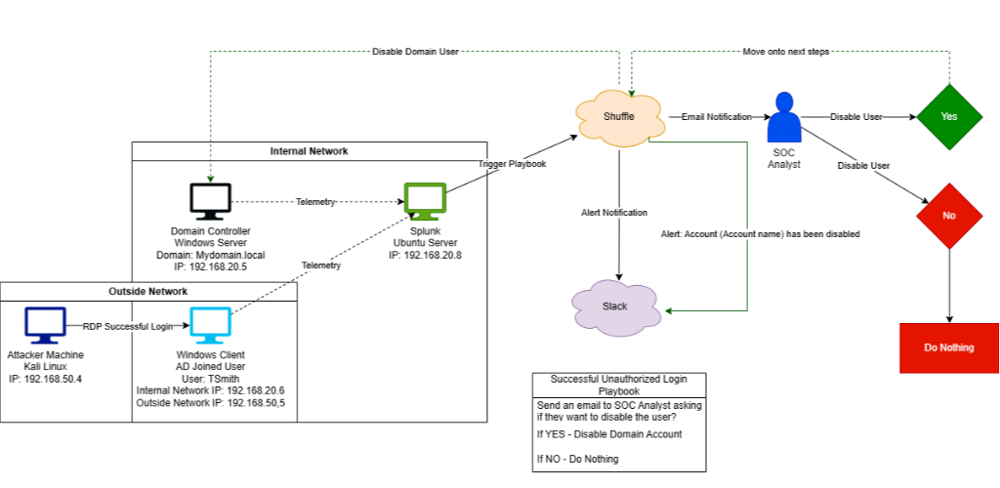
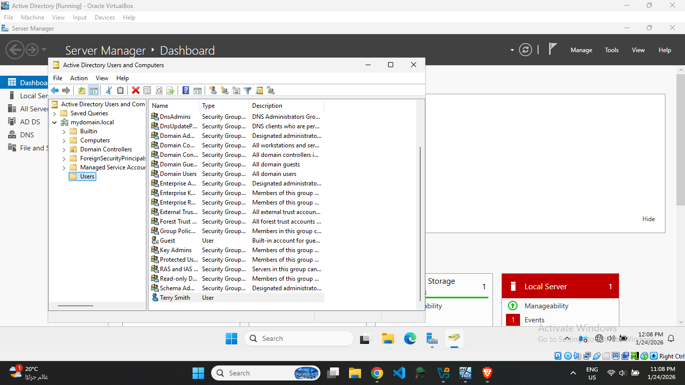
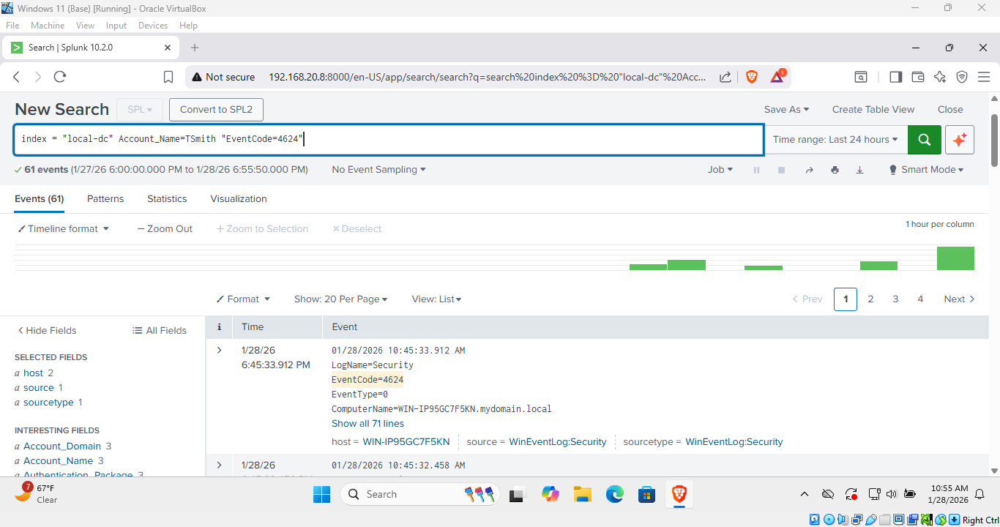
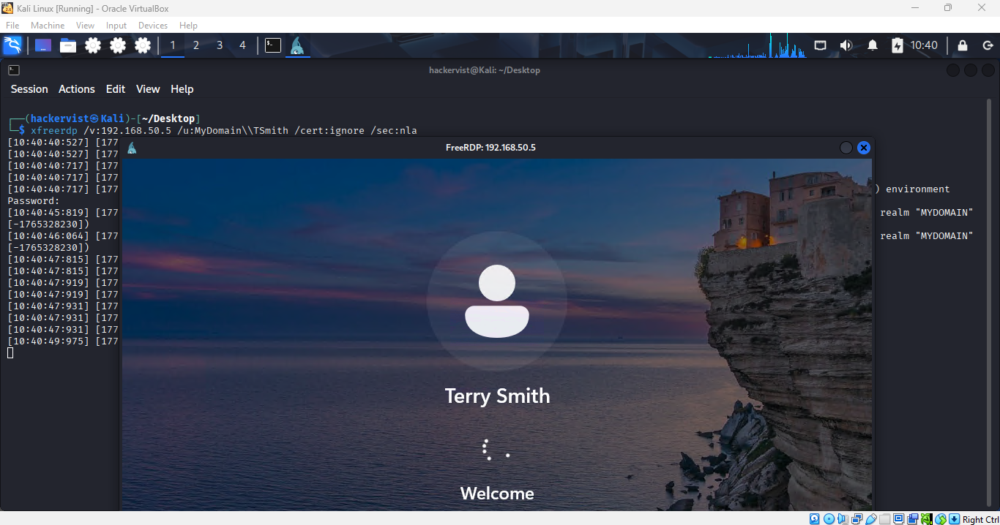
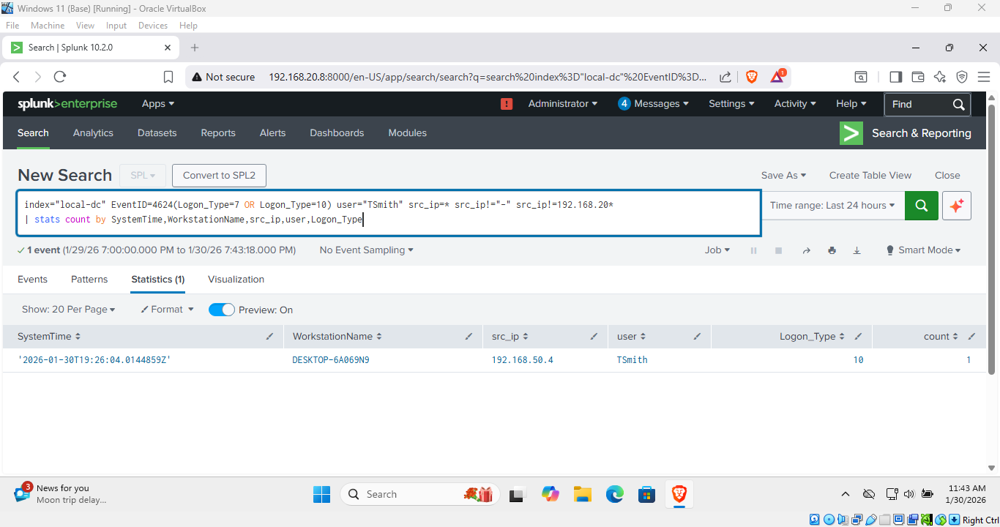
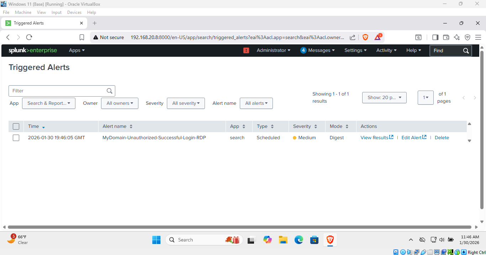
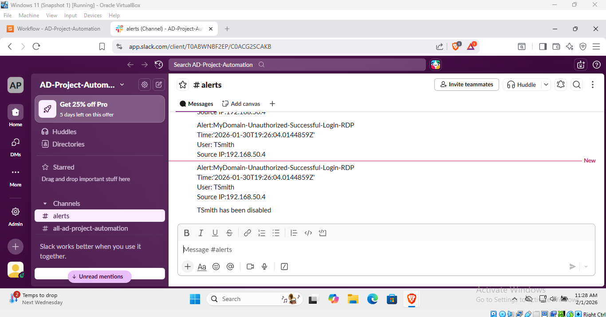
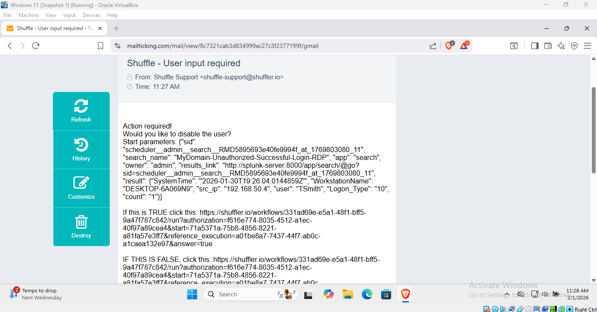

# Active Directory RDP Alerting & SOAR Automation Lab

## TL;DR
Built a multi-VM Active Directory lab to simulate an external RDP attack against a domain-joined Windows system. Logs were ingested into Splunk, a detection alert was created for suspicious RDP access, and the alert was automated using Shuffle SOAR to notify analysts via Slack and guide response decisions.

---

## Project Overview
This project simulates a real-world enterprise Active Directory environment to detect and respond to suspicious remote logins originating from outside the internal network. The lab focuses on generating Windows authentication telemetry, detecting anomalous RDP access in Splunk, and automating alert response workflows using Shuffle and Slack with human approval steps.

The primary objective is to demonstrate how SIEM detections can be integrated with SOAR platforms to enable alert enrichment, analyst decision-making, and automated remediation actions in Active Directory.

---

## Lab Architecture

**Network Design**
- Internal network: `192.168.10.0/24`
- External attacker network: Separate isolated subnet

**Systems**
- **Windows Server 2022** – Active Directory Domain Controller  
- **Windows Client** – Domain-joined workstation (dual network interfaces)  
- **Ubuntu Server** – Splunk Enterprise Server  
- **Linux Attacker** – External system used for RDP access  

**Key Design Choice**
The Windows client uses two network adapters:
- One connected to the internal AD/Splunk network
- One connected to an isolated external network to simulate inbound access from outside the domain

This allows the attacker system to RDP into the Windows client without having visibility into the internal infrastructure.
  

*Lab architecture showing Active Directory, internal endpoints, external attacker, and Splunk SOAR workflow.*

---

## Environment Setup

### Active Directory
- Promoted Windows Server 2022 to Domain Controller
- Created domain users in Active Directory
- Joined Windows client to the domain

  

*Active Directory domain and users.*

### Splunk Configuration
- Installed Splunk Enterprise on Ubuntu Server
- Installed Splunk Universal Forwarder on:
  - Windows Server (Domain Controller)
  - Windows Client
- Configured forwarders to send logs to Splunk on port `9997`
- Created a dedicated index("local-dc") for endpoint and authentication logs

  

*Splunk receiving authentication events from domain-joined systems.*

### Logging Focus
- Windows Security Event Logs
- Authentication and logon-related events
- RDP activity originating from external IP addresses

---

## Attack Simulation

### External RDP Login
- Linux attacker system initiated an RDP connection to the Windows client
- Login performed using a valid Active Directory domain account
- Source IP originated from outside the internal network

This activity generated authentication telemetry on the Windows client, which was forwarded to Splunk for analysis.

  

*Successful RDP authentication*
 

  

*RDP authentication from an external IP detected in Splunk.*

---

## Detection & Analysis (Splunk)

### Detection Logic
The detection focuses on:
- Successful logon events (Event ID 4624)
- Logon Type 10 (RemoteInteractive / RDP)
- Source IP addresses outside the internal subnet

### Alert Trigger
An alert is generated when:
- A successful RDP login occurs
- The source IP is not part of the internal network range

  

*Splunk alert configured to detect external RDP access.*

---

## SOAR Automation (Shuffle)

### Workflow Overview
1. Splunk alert triggers a webhook
2. Alert data is sent to Shuffle
3. Shuffle parses event details (username, source IP, host)
4. Alert is sent to Slack using slack integration
5. Analyst approval step determines response action
6. If approved:
   - Active Directory account is disabled
   - Confirmation message is posted to Slack

  

*Shuffle SOAR workflow handling alert ingestion, analyst input, and response logic.*

---

## Alert Notification (Slack)

### Slack Integration
When the alert fires:
- Event details are posted to Slack
- Includes source IP, username, and target host

  

*Automated Slack alert generated from Splunk detection via Shuffle.*

---

## Analyst Decision & Automated Response

### Human-in-the-Loop Approval
- Analyst receives alert in Slack
- Analyst decides whether to disable the account

*Alert Received by the analyst.*

### Automated Remediation
If approved:
- Shuffle executes an action against Active Directory
- The user account is disabled
- Slack receives a confirmation message

---

## Key Skills Demonstrated
- Active Directory administration and domain management
- Windows authentication and RDP log analysis
- SIEM-based detection using Splunk
- SOAR workflow design with Shuffle
- Alert automation with Shuffle and Slack
- Human-approved automated incident response

---

## Key Takeaways
- Demonstrated detection of external access into an internal domain environment
- Correlating source IP and logon type significantly improves detection confidence
- Built an end-to-end SIEM → SOAR → notification → remediation pipeline
- Implemented realistic SOC analyst decision-making instead of full auto-remediation
- Gained hands-on experience adapting to tooling limitations and integration changes

---

## Reflection
This project strengthened my understanding of:
- Active Directory authentication behavior
- Splunk detection engineering
- SOC alert triage workflows
- SOAR automation concepts with human-in-the-loop decisions

---

## Tools Used
- Splunk Enterprise
- Splunk Universal Forwarder
- Windows Server 2022 (Active Directory)
- Windows 11 Client
- Ubuntu Server
- Shuffle SOAR
- Slack
- Linux (RDP attacker simulation)
- VirtualBox
---
